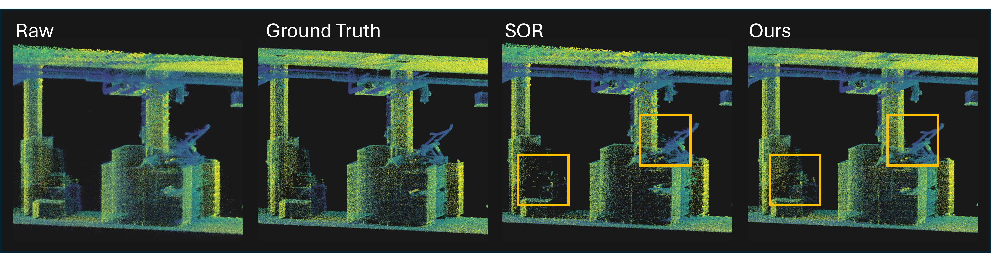

# GhostBuster

Per-point confidence for LiDAR SLAM maps.



The same slice, with 30 % of the points removed by each method. Ground truth
removes the points that really are farthest from a survey-grade reference. The
boxes show the two ways SOR pays for that budget: on the right it keeps clutter,
because once the scans are merged those points have neighbours, and on the left
it strips real detail off the structure. Our model keeps the detail and removes
the clutter.

A LiDAR SLAM pipeline knows far more about each point than the finished cloud
shows: the sensor records how a point was measured, the SLAM how well it fitted
the map. Both are normally discarded once the trajectory is final. This code
keeps that information, combines it with the geometry of the assembled cloud,
and trains a model to predict how far each point really is from a survey-grade
reference. Ranking by that prediction cleans a map better than a geometric
filter such as Statistical Outlier Removal.

The repository contains the whole chain: the instrumented SLAM that writes the
channels, the labelling pipeline that produces per-point ground truth from a
Leica RTC360 project, the feature stages, and the training and evaluation code.

`PIPELINE.md` describes every script and the stage it belongs to.

## What the pipeline does

```
  1. SLAM          bag            -> per-scan clouds, trajectory, channels A, B, C
  2. Labelling     cloud + RTC360 -> C2C distance per point + evaluation domain
  3. Features      labelled cloud -> channels D and E added
  4. Model         featured clouds-> confidence model, metrics, tables
```

Point coordinates are never altered. Stages 2 to 4 only add channels and labels,
so the cloud a model is trained on is exactly the cloud the SLAM produced.

**The five channel families**

| | what it sees | available |
|---|---|---|
| **A** raw sensor | intensity, reflectivity, ambient, beam index, time in sweep, range | while mapping |
| **B** within-scan | how a return sits against its neighbours on the organised range image, before downsampling | while mapping |
| **C** SLAM-internal | point-to-plane residuals, plane quality, angular rate, pose uncertainty, and per-voxel observation statistics | partly while mapping |
| **D** aggregates | each A–C channel against its 30 nearest neighbours in the finished map | needs the map |
| **E** geometry | multi-scale kNN distance and roughness, what classical filters use | needs the map |

**The evaluation domain** matters as much as the distance. A reference taken
from tripod stations has shadows behind furniture and walls that a handheld
scanner walks past, so a plain nearest-neighbour distance cannot tell a real
15 cm error in front of a wall from a point 15 cm behind it in a shadow. Each
station is rebuilt as a range panorama and every point is asked whether any
scanner could have seen it. Only points that pass are labelled.

## Layout

```
  VoxelSLAM/             instrumented VoxelSLAM: writes families A, B, C
    src/                 the SLAM itself; range_image.hpp is family B
    scripts/             global_pcd_converter.py merges scans into a global map
    launch/ config/      the Ouster and Hesai setups used in the paper
  scripts/               labelling, features, training, evaluation
    gtlabel/             registration, visibility, C2C, geometry, chunked LAS I/O
    configs/             per-scene settings behind the published results
  PIPELINE.md            what each script does
```

## Requirements

Python 3.8+ with `numpy`, `scipy`, `scikit-learn`, `laspy`, `matplotlib`,
`pyyaml`, `joblib`, and `pye57` for reading RTC360 exports. The SLAM is a ROS
package and builds with `catkin`; it needs PCL, Eigen and Ceres.

## Minimal reproduction

One scene, held out, from a recorded session. Paths are placeholders.

```bash
# 1. SLAM. The A, B and C channels are written here, per scan. On `finish` the
#    node runs global_pcd_converter.py itself, merging the scans with the final
#    trajectory into <bagname>_global/ and completing the per-voxel statistics.
roslaunch vxlm_ouster.launch
rosparam set finish true

# 2. Label against the RTC360 stations: registration, visibility, C2C.
python scripts/prepare_labels_e57.py --config scripts/configs/<scene>.yaml

# 3. Re-label in 15 m trajectory pieces so the labels do not carry drift.
#    The cloud itself is not moved, only the frame each label is computed in.
python scripts/stretch_labels.py \
    --cloud  <scene>/labeled/global_map.las \
    --traj   <slam_out>/alidarState.txt \
    --labels <scene>/labeled/global_map_labels.json \
    --config scripts/configs/<scene>.yaml \
    --stretch-metres 15 \
    --out    <scene>/labeled/global_map_feat.las

# 4. Add the neighbourhood families. Geometry first: the ratios are built from it.
python scripts/add_geom_features.py      --in <scene>/labeled/global_map_feat.las
python scripts/add_aggregate_features.py --in <scene>/labeled/global_map_feat.las --ks 30
python scripts/add_ratio_features.py     --in <scene>/labeled/global_map_feat.las

# 5. Hold one scene out, train on the rest, score every baseline in the same run.
python scripts/compare_filters.py \
    <sceneA>/labeled/global_map_feat.las \
    <sceneB>/labeled/global_map_feat.las \
    <sceneC>/labeled/global_map_feat.las \
    <held_out>/labeled/global_map_feat.las \
    --holdout <held_out> \
    --normalise-per-scene rank --normalise-target \
    --early-stopping-split cell --group-field cell_id \
    --max-per-dataset 6000000 --fit-n 500000 --save-models \
    --out results/<held_out>
```

This writes `filter_comparison.json`, a `ranking_summary.txt` ranking every
method by lift and Spearman correlation, and the removal-budget curves.

To apply a trained model to a whole cloud:

```bash
python scripts/predict_cloud.py \
    --model results/<held_out>/models/slam_plus_mean.joblib --name confidence \
    --in  <cloud>.las --out <cloud>_scored.las --removed 0.30
```

This adds `pred_confidence`, the predicted distance to the reference, and
`keep_confidence`, which is 0 for the worst 30 %.

## Licence

`VoxelSLAM/` is a modified version of
[Voxel-SLAM](https://github.com/hku-mars/Voxel-SLAM) and keeps its licence,
**GPL-2.0-or-later**. The upstream copyright is unchanged; `VoxelSLAM/NOTICE`
lists what we modified, as that licence requires.

Everything under `scripts/` is our own work and is released under the
**MIT License** (see `LICENSE`). It is a separate program: it reads the
files the SLAM writes and does not link against or include any part of
Voxel-SLAM, so the two are distributed together as an aggregate rather than as
one combined work.

The dataset is published separately and carries its own licence.

